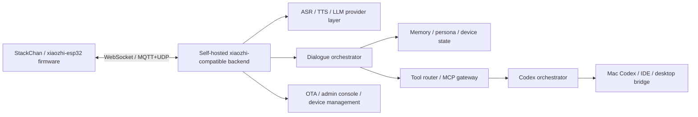

# Xiaozhi Final Platform Research

Date: 2026-04-24

This note captures the current conclusion for the "final version" direction of the StackChan project.

## Bottom Line

If the goal is:

- robot voice interaction in `AI.AGENT`
- Codex task execution on the computer
- Codex completion triggering a new robot-initiated conversation
- AI rephrasing results naturally before speaking
- long-term stable control over dialogue flow, model choice, and event timing

then we should move toward a **self-hosted xiaozhi-compatible backend**.

This does **not** require cloning every feature from `xiaozhi.me` on day one.
It **does** require owning the following layers:

- session lifecycle
- model orchestration
- tool routing
- Codex event injection
- active dialogue triggering
- TTS response generation

## Confirmed Facts

### 1. Device-side xiaozhi is open source and actively maintained

- Official firmware repo: [78/xiaozhi-esp32](https://github.com/78/xiaozhi-esp32)
- It is MIT licensed
- It explicitly supports:
  - `WebSocket`
  - `MQTT+UDP`
  - device-side MCP
  - cloud-side MCP
- Its README says the firmware connects to `xiaozhi.me` by default and model configuration is done through the official console.

### 2. The old official server repo exists, but is no longer maintained

- Official server repo: [78/xiaozhi](https://github.com/78/xiaozhi)
- The repository README explicitly says the project is no longer maintained.

Conclusion:

- do **not** use `78/xiaozhi` as the long-term base for the final system

### 3. Official docs confirm that custom model/API support requires your own server

Official Q&A states:

- supported models on the official platform are switched in the console
- if users want other model APIs or self-hosted models, they must implement their own server

Reference:

- [Xiaozhi AI Q&A](https://home.xiaozhi.me/xz-docs/docs/help-doc/xiaozhi-ai-chatbot-q%26a)

### 4. The wire protocol is open enough to build against

Official protocol docs publicly describe:

- connection headers
- hello exchange
- `listen` lifecycle
- TTS status messages
- `iot` messages
- binary audio transport

Reference:

- [WebSocket Protocol](https://home.xiaozhi.me/xz-docs/docs/tutorial-comm/websocket-comm/)

## What This Means For Our Project

The current local implementation in this repository is a good **intermediate stable layer**:

- robot -> MCP -> `Aida Bridge`
- `Aida Bridge` -> `codex exec`
- completion -> robot local notification

That is stable and useful, but it is **not yet** the final system.

It does not fully own:

- dialogue scheduling
- active speaking rights
- server-side role policy
- server-side memory policy
- unified Codex event orchestration

For the final version, `Aida Bridge` should evolve into a subsystem inside the self-hosted backend, not remain the entire architecture.

## Recommended Final Architecture

## Recommended Ownership Split

### Keep and reuse

- `StackChan` firmware customizations in this repo
- wake word and localization changes
- `Aida Bridge` code as the seed for Codex orchestration

### Build ourselves

- the main backend control plane
- dialogue orchestrator
- active conversation trigger logic
- memory and device state layer
- admin configuration layer tailored to this project

### Use only as references, not as final core dependency

- [xinnan-tech/xiaozhi-esp32-server](https://github.com/xinnan-tech/xiaozhi-esp32-server)
- [AnimeAIChat/xiaozhi-server-go](https://github.com/AnimeAIChat/xiaozhi-server-go)
- [joey-zhou/xiaozhi-esp32-server-java](https://github.com/joey-zhou/xiaozhi-esp32-server-java)

## Evaluation Of Existing Server Options

### Option A: `xinnan-tech/xiaozhi-esp32-server`

Pros:

- richest feature coverage
- clearly targets self-hosted backend deployment
- supports `MQTT+UDP`, `WebSocket`, MCP access point, voiceprint, knowledge base
- has deployment docs and multiple modes

Cons:

- README explicitly warns it is incomplete and should not be used in production as-is
- mixed-language, mixed-stack architecture increases maintenance complexity
- not ideal as the final minimal core for a deeply custom personal robot stack

Best use:

- protocol and feature reference
- deployment and component composition reference

### Option B: `AnimeAIChat/xiaozhi-server-go`

Pros:

- Go-based, closer to the current `Aida Bridge` direction
- supports `WebSocket`, MCP, OTA, local model options
- operationally simpler for us than a mixed Python/Java/Vue stack

Cons:

- strong commercial/product packaging direction
- license must be reviewed carefully before treating it as a hard dependency
- architecture is useful, but we should avoid binding ourselves to third-party product priorities

Best use:

- Go architecture reference
- config layout reference
- protocol compatibility reference

### Option C: `78/xiaozhi`

Pros:

- official lineage

Cons:

- explicitly unmaintained
- too risky as the base for a long-lived final platform

Best use:

- historical reference only

## Recommended Technical Direction

For the final platform, use:

- firmware compatibility from `78/xiaozhi-esp32`
- our own backend in `Go`
- `Aida Bridge` promoted into a backend `Codex Orchestrator` module
- official `WebSocket` protocol compatibility first
- `MQTT+UDP` support only if later needed

Reason:

- it gives us full control over active dialogue
- it keeps the backend close to the language and structure already used in this repository
- it avoids long-term dependence on abandoned or commercially opinionated server stacks

## Phase Plan

### Phase 1: Practical stable foundation

- keep the current `Aida Bridge` flow working
- finish firmware flash and real robot validation
- confirm `AI.AGENT` can trigger `codex_run`, `codex_list`, `codex_status`, `codex_cancel`

### Phase 2: Server-owned active narration

- introduce a backend summarizer/orchestrator service
- Codex completion becomes a structured backend event
- backend decides whether to notify now
- backend generates a spoken summary
- robot receives a full server-originated spoken interaction, not only a local reminder

### Phase 3: Replace official platform dependency

- point device OTA / WS endpoint to our own backend
- move role/model configuration into our backend/admin tools
- own memory, device state, agent policy, and event scheduling end-to-end

## Hard Requirement For "Perfect Final Version"

If the robot is supposed to:

- proactively speak
- choose the right moment
- summarize Codex results in its own style
- maintain memory and persona
- coordinate multiple desktop tasks over time

then the backend must be the true source of authority.

The device should become a very capable client.
The backend should become the robot's actual brain.

## Immediate Next Step For The Next Session

When resuming on another machine, start with this decision:

1. create a new backend workspace/repo for the self-hosted platform, or
2. create a `backend/` directory inside this monorepo for the first prototype

My recommendation:

- start inside this monorepo for faster iteration
- split into a dedicated repo only after the backend boundary becomes stable

## Suggested Backend Modules For The Prototype

- `backend/gateway/ws`
- `backend/orchestrator/dialogue`
- `backend/orchestrator/codex`
- `backend/providers/asr`
- `backend/providers/tts`
- `backend/providers/llm`
- `backend/state/memory`
- `backend/state/device`
- `backend/admin`

## Notes For The Next Machine

- Current branch already contains:
  - Chinese localization work
  - `Hey Aida` wake word changes
  - stable `Aida Bridge` integration
  - recent Codex task listing
- The current branch is the correct place to continue from:
  - `feature/stackchan-cn-codex`
